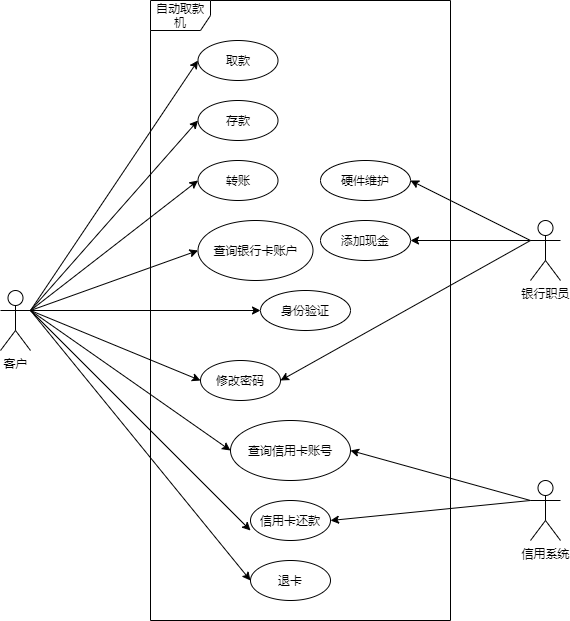
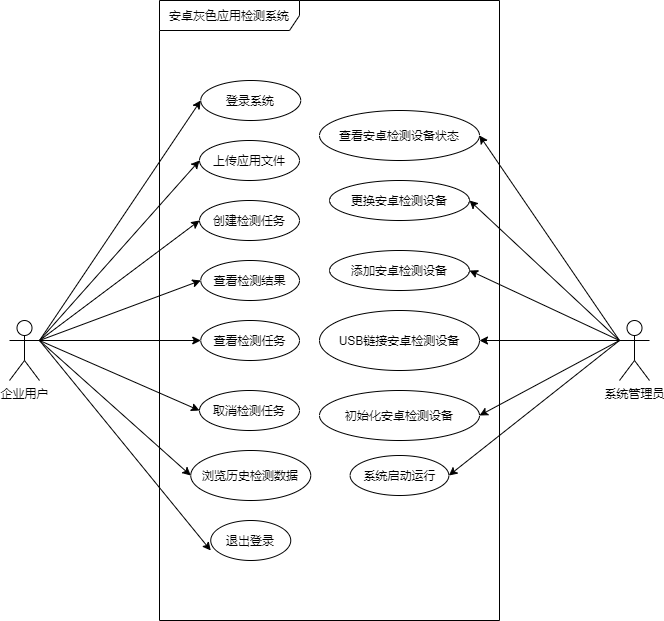

# 软件工程第一次作业

## 第一题  ATM自动取款机

ATM自动取款机是银行在银行营业大厅、超市、商业机构、机场、车站、码头和闹市区设置的一种小型机器，利用一张信用卡大小的胶卡上的磁带〔或芯片卡上的芯片〕记录客户的基本户口资料，让客户可以透过机器进行提款、存款、转帐等银行柜台服务。 

1. 客户将银行卡插入读卡器，读卡器识别卡的真伪，并在显示器上提示输入密码。 
2. 客户通过键盘输入密码，取款机验证密码是否有效。如果密码错误提示错误信息，如果正确，提示客户进行选择操作的业务。 
3. 客户根据自己的需要可进行银行账号的存款、取款、查询账户、转账、修改密码的操作。
4. 客户还可以进行查询和还款自己的信用卡账号的操作。
5. 在客户选择后显示器进行交互提示和操作确认等信息。
6. 操作完毕后，客户可自由选择打印或不打印凭条。
7. 银行职员可进行对ATM自动取款机的硬件维护和添加现金的操作。

请对上述需求分析画出用例图和用例说明（用例表）。

### 用例图

### 用例表

身份验证

| 用例               | 身份验证                                                |
| ------------------ | ------------------------------------------------------- |
| 主要参与者         | 客户                                                    |
| 目标               | 验证用户是否与自己的银行/信用卡匹配，使用户安全登录系统 |
| 实现条件           | 系统支持读卡器识别、密码输入识别                        |
| 触发器             | 客户将银行/信用卡插入读卡器                             |
| 场景               | 1.客户：将银行/信用卡插入读卡器                         |
|                    | 2.显示器提示输入密码                                    |
|                    | 3.客户：输入密码                                        |
|                    | 4.显示器显示选择操作业务，提示用户进行下一步操作        |
| 异常               | 1.密码错误：显示器提示错误信息                          |
|                    | 2.读卡错误：显示器提示错误信息                          |
| 优先级             | 必须实现                                                |
| 前置条件           | 系统与客户交互的开始                                    |
| 使用频率           | 每天多次                                                |
| 使用方式           | 通过读卡器与带显示器的控制面板                          |
| 次要参与者         | 无                                                      |
| 次要参与者使用方式 | 无                                                      |
| 未解决的问题       | 1.是否还应该有不使用密码或者使用缩略密码的方式          |
|                    | 2.输入密码第一个按键后必须在多久之前输入下一个          |

取款

| 用例               | 取款                                                         |
| ------------------ | ------------------------------------------------------------ |
| 主要参与者         | 客户                                                         |
| 目标               | 取钱                                                         |
| 前提条件           | 系统支持功能选择、输入交互，输出钱款                         |
| 触发器             | 客户选择取款功能                                             |
| 场景               | 1.客户：选择取款功能                                         |
|                    | 2.客户：通过显示器的交互提示、操作确认等，执行输入取款额度等操作 |
|                    | 3.客户：查看ATM机输出口，取出钱款                            |
|                    | 4.显示器显示选择是否打印，客户选择后取/不取凭条，回到操作业务选择界面 |
| 异常               | 1.取款错误：显示器提示错误信息                               |
| 优先级             | 必须实现                                                     |
| 何时可用           | 客户成功登录系统之后且客户位于操作业务选择界面               |
| 使用频率           | 每天多次                                                     |
| 使用方式           | 通过带显示器的控制面板与输出口                               |
| 次要参与者         | 无                                                           |
| 次要参与者使用方式 | 无                                                           |
| 未解决的问题       | 1.如何处理系统故障                                           |

存款

| 用例               | 存款                                                         |
| ------------------ | ------------------------------------------------------------ |
| 主要参与者         | 客户                                                         |
| 目标               | 存钱                                                         |
| 前提条件           | 系统支持功能选择、输入交互输入钱款                           |
| 触发器             | 客户选择存款功能                                             |
| 场景               | 1.客户：选择存款功能                                         |
|                    | 2.客户：通过显示器的交互提示、操作确认等，执行设定存款额度等操作 |
|                    | 3.客户：查看ATM机输入口，放入钱款                            |
|                    | 4.显示器显示选择是否打印，客户选择后取/不取凭条，回到操作业务选择界面 |
| 异常               | 1.存款错误：显示器提示错误信息                               |
| 优先级             | 必须实现                                                     |
| 何时可用           | 客户成功登录系统之后且客户位于操作业务选择界面               |
| 使用频率           | 每天多次                                                     |
| 使用方式           | 通过带显示器的控制面板与输入口                               |
| 次要参与者         | 无                                                           |
| 次要参与者使用方式 | 无                                                           |
| 未解决的问题       | 1.如何处理系统故障                                           |

转账

| 用例               | 转账                                                         |
| ------------------ | ------------------------------------------------------------ |
| 主要参与者         | 客户                                                         |
| 目标               | 转账                                                         |
| 前提条件           | 系统支持功能选择、输入交互                                   |
| 触发器             | 客户选择转账功能                                             |
| 场景               | 1.客户：选择转账功能                                         |
|                    | 2.客户：通过显示器的交互提示、操作确认等，执行输入转账额度等操作 |
|                    | 3.显示器显示选择是否打印，客户选择后取/不取凭条，回到操作业务选择界面 |
| 异常               | 1.转账错误：显示器提示错误信息                               |
| 优先级             | 必须实现                                                     |
| 何时可用           | 客户成功登录系统之后且客户位于操作业务选择界面               |
| 使用频率           | 每天多次                                                     |
| 使用方式           | 通过带显示器的控制面板                                       |
| 次要参与者         | 无                                                           |
| 次要参与者使用方式 | 无                                                           |
| 未解决的问题       | 1.如何处理系统故障                                           |

查询银行卡账户

| 用例               | 查询银行卡账户                                               |
| ------------------ | ------------------------------------------------------------ |
| 主要参与者         | 客户                                                         |
| 目标               | 查询客户的银行卡账户                                         |
| 前提条件           | 系统支持功能选择、输入交互                                   |
| 触发器             | 客户选择查询银行卡账户功能                                   |
| 场景               | 1.客户：选择查询银行卡账户功能                               |
|                    | 2.客户：通过显示器的交互提示、操作确认等，执行查看账户各信息等操作 |
|                    | 3.显示器显示选择是否打印，客户选择后取/不取凭条，回到操作业务选择界面 |
| 异常               | 1.查询请求失败：显示器提示错误信息                           |
| 优先级             | 必须实现                                                     |
| 何时可用           | 客户成功登录系统之后且客户位于操作业务选择界面               |
| 使用频率           | 每天多次                                                     |
| 使用方式           | 通过带显示器的控制面板                                       |
| 次要参与者         | 无                                                           |
| 次要参与者使用方式 | 无                                                           |
| 未解决的问题       | 1.如何处理系统故障                                           |

修改密码

| 用例               | 修改密码                                                     |
| ------------------ | ------------------------------------------------------------ |
| 主要参与者         | 客户                                                         |
| 目标               | 修改客户的账户密码                                           |
| 前提条件           | 系统支持功能选择、输入交互                                   |
| 触发器             | 客户选择修改账户密码功能                                     |
| 场景               | 1.客户：选择修改账户密码功能                                 |
|                    | 2.客户：通过显示器的交互提示、操作确认等，执行输入新密码等操作 |
|                    | 3.显示器显示选择是否打印，客户选择后取/不取凭条，回到操作业务选择界面 |
| 异常               | 1.修改错误：显示器提示错误信息                               |
| 优先级             | 必须实现                                                     |
| 何时可用           | 客户成功登录系统之后且客户位于操作业务选择界面               |
| 使用频率           | 每天多次                                                     |
| 使用方式           | 通过带显示器的控制面板                                       |
| 次要参与者         | 银行职员                                                     |
| 次要参与者使用方式 | 通过指定的接口修改任意指定用户的密码                         |
| 未解决的问题       | 1.银行职员修改密码的接口是如何的？                           |

查询信用卡账号

| 用例               | 查询信用卡账号                                               |
| ------------------ | ------------------------------------------------------------ |
| 主要参与者         | 客户                                                         |
| 目标               | 查询客户的信用卡账号                                         |
| 前提条件           | 系统支持功能选择、输入交互                                   |
| 触发器             | 客户选择查询信用卡账号功能                                   |
| 场景               | 1.客户：选择查询信用卡账号功能                               |
|                    | 2.客户：通过显示器的交互提示、操作确认等，执行查看账户各信息等操作 |
|                    | 3.显示器显示选择是否打印，客户选择后取/不取凭条，回到操作业务选择界面 |
| 异常               | 1.查询请求失败：显示器提示错误信息                           |
| 优先级             | 必须实现                                                     |
| 何时可用           | 客户成功登录系统之后且客户位于操作业务选择界面               |
| 使用频率           | 每天多次                                                     |
| 使用方式           | 通过带显示器的控制面板                                       |
| 次要参与者         | 信用系统                                                     |
| 次要参与者使用方式 | 通过指定的接口查询任意指定用户的信用卡账号                   |
| 未解决的问题       | 1.信用系统查询用户信用卡账号的接口是如何的？                 |

信用卡还款

| 用例               | 信用卡还款                                                   |
| ------------------ | ------------------------------------------------------------ |
| 主要参与者         | 客户                                                         |
| 目标               | 还信用卡欠下的钱款                                           |
| 前提条件           | 系统支持功能选择、输入交互、钱款输入                         |
| 触发器             | 客户选择信用卡还款功能                                       |
| 场景               | 1.客户：选择查询信用卡账号功能                               |
|                    | 2.客户：通过显示器的交互提示、操作确认等，执行设定还款各参数等操作 |
|                    | 3.客户：查看ATM机输入口，放入钱款                            |
|                    | 4.显示器显示选择是否打印，客户选择后取/不取凭条，回到操作业务选择界面 |
| 异常               | 1.还款失败：显示器提示错误信息                               |
| 优先级             | 必须实现                                                     |
| 何时可用           | 客户成功登录系统之后且客户位于操作业务选择界面               |
| 使用频率           | 每天多次                                                     |
| 使用方式           | 通过带显示器的控制面板与输入口                               |
| 次要参与者         | 信用系统                                                     |
| 次要参与者使用方式 | 通过指定的接口替用户还款                                     |
| 未解决的问题       | 1.信用系统为用户还款的接口是如何的？                         |

退卡

| 用例               | 退卡                                           |
| ------------------ | ---------------------------------------------- |
| 主要参与者         | 客户                                           |
| 目标               | 客户结束业务并将插在读卡器里的卡弹出取回       |
| 前提条件           | 系统支持功能选择、输入交互、弹出卡片           |
| 触发器             | 用户选择退卡                                   |
| 场景               | 1.客户：选择退卡                               |
|                    | 2.客户：弹出卡片，收走卡                       |
| 异常               | 1.退卡失败：提示错误信息                       |
| 优先级             | 必须实现                                       |
| 何时可用           | 客户成功登录系统之后且客户位于操作业务选择界面 |
| 使用频率           | 每天多次                                       |
| 使用方式           | 通过带显示器的控制面板与读卡器                 |
| 次要参与者         | 无                                             |
| 次要参与者使用方式 | 无                                             |
| 未解决的问题       | 无                                             |

硬件维护

| 用例               | 硬件维护                                         |
| ------------------ | ------------------------------------------------ |
| 主要参与者         | 银行职员                                         |
| 目标               | 维护ATM机硬件                                    |
| 前提条件           | 系统支持调整为一种允许拆卸与维护的状态           |
| 触发器             | 职员按动按钮，将系统调整到允许拆卸与维护的状态   |
| 场景               | 1.职员：按动按钮，系统调整到允许拆卸与维护的状态 |
|                    | 2.职员：进行拆卸、硬件维护                       |
|                    | 3.职员：完成维护，将系统复位                     |
| 异常               | 1.维护失败：报告错误                             |
| 优先级             | 必须实现                                         |
| 何时可用           | 任何需要维护机器的时候                           |
| 使用频率           | 定期维护，偶发意外情况下维护                     |
| 使用方式           | 通过本地设备交互进行物理上的维护                 |
| 次要参与者         | 无                                               |
| 次要参与者使用方式 | 无                                               |
| 未解决的问题       | 1.维护具体涉及哪些方面的支持？                   |

添加现金

| 用例               | 添加现金                                             |
| ------------------ | ---------------------------------------------------- |
| 主要参与者         | 银行职员                                             |
| 目标               | 往ATM中加入现金                                      |
| 前提条件           | 系统支持调整到一种支持拆卸与添加现金的状态           |
| 触发器             | 职员按动按钮，系统调整到允许拆卸与添加现金的状态     |
| 场景               | 1.职员：按动按钮，系统调整到允许拆卸与添加现金的状态 |
|                    | 2.职员：进行拆卸、添加现金                           |
|                    | 3.职员：完成现金添加，将系统复位                     |
| 异常               | 1.添加现金失败：报告错误                             |
| 优先级             | 必须实现                                             |
| 何时可用           | 任何需要添加现金的时候                               |
| 使用频率           | 定期添加，或者现金用完的时候                         |
| 使用方式           | 通过本地设备交互进行物理上添加现金                   |
| 次要参与者         | 无                                                   |
| 次要参与者使用方式 | 无                                                   |
| 未解决的问题       | 1.添加现金涉及到的物理机体需求有哪些？               |

## 安卓灰色应用检测系统

### 用例图

### 用例说明

登录系统

| 用例               | 登录系统                           |
| ------------------ | ---------------------------------- |
| 主要参与者         | 企业用户                           |
| 目标               | 验证用户的身份，使其安全登录系统   |
| 前提条件           | 系统支持基本的信息交互             |
| 触发器             | 用户选择查看检测结果               |
| 场景               | 1.企业用户：打开应用，输入账号密码 |
|                    | 2.企业用户：点击登录进入主界面     |
| 异常               | 1.账号密码无效：返回提示信息       |
| 优先级             | 必须实现                           |
| 何时可用           | 用户与系统交互的开始               |
| 使用频率           | 每天可能多次                       |
| 使用方式           | 通过网络应用进行信息交互           |
| 次要参与者         | 无                                 |
| 次要参与者使用方式 | 无                                 |
| 未解决的问题       | 无                                 |

上传应用文件

| 用例               | 上传应用文件                                   |
| ------------------ | ---------------------------------------------- |
| 主要参与者         | 企业用户                                       |
| 目标               | 上传一个或多个应用文件到检测平台               |
| 前提条件           | 系统支持基本的信息交互与文件上传               |
| 触发器             | 企业用户选择上传文件等                         |
| 场景               | 1.企业用户：选择上传，弹出文件选择框           |
|                    | 2.企业用户：选择上传的文件                     |
|                    | 3.企业用户：查看上传结果，确认上传，回到主界面 |
| 异常               | 1.上传失败：提示错误信息                       |
| 优先级             | 必须实现                                       |
| 何时可用           | 用户完成登录并且在主界面，想要上传文件的时候   |
| 使用频率           | 每天可能多次                                   |
| 使用方式           | 通过网络应用进行文件与信息交互                 |
| 次要参与者         | 无                                             |
| 次要参与者使用方式 | 无                                             |
| 未解决的问题       | 1.关于上传所用到的网络应用具体信息有哪些？     |

创建检测任务

| 用例               | 创建检测任务                                     |
| ------------------ | ------------------------------------------------ |
| 主要参与者         | 企业用户                                         |
| 目标               | 创建一个检测任务并开始执行它                     |
| 前提条件           | 系统支持基本的信息交互                           |
| 触发器             | 企业用户选择创建新任务                           |
| 场景               | 1.企业用户：选择创建新任务，弹出任务创建界面     |
|                    | 2.企业用户：设定任务各参数                       |
|                    | 3.企业用户：确认创建完毕，开始新任务，回到主界面 |
| 异常               | 1.创建失败：显示错误信息                         |
| 优先级             | 必须实现                                         |
| 何时可用           | 用户完成登录并且在主界面，想要创建任务的时候。   |
| 使用频率           | 每天可能多次                                     |
| 使用方式           | 通过网络应用进行信息交互                         |
| 次要参与者         | 无                                               |
| 次要参与者使用方式 | 无                                               |
| 未解决的问题       | 1.创建任务所需要的具体参数信息有哪些？           |

查看检测结果

| 用例               | 查看检测结果                                     |
| ------------------ | ------------------------------------------------ |
| 主要参与者         | 企业用户                                         |
| 目标               | 用户将能够查看某个已完成的检测任务的最终结果     |
| 前提条件           | 系统支持基本的信息交互                           |
| 触发器             | 用户选择查看检测结果                             |
| 场景               | 1.企业用户：选择查看检测结果，弹出已完成任务列表 |
|                    | 2.企业用户：选择已完成任务，确认并查看其检测结果 |
|                    | 3.企业用户：完成查看，选择返回已完成任务列表     |
|                    | 4.企业用户：选择退出已完成列表，回到主界面       |
| 异常               | 1.没有已完成任务：返回提示信息                   |
| 优先级             | 必须实现                                         |
| 何时可用           | 用户完成登录并且在主界面，想要查看检测结果的时候 |
| 使用频率           | 每天多次                                         |
| 使用方式           | 通过网络应用进行信息交互                         |
| 次要参与者         | 无                                               |
| 次要参与者使用方式 | 无                                               |
| 未解决的问题       | 无                                               |

查看检测任务

| 用例               | 查看检测任务                                               |
| ------------------ | ---------------------------------------------------------- |
| 主要参与者         | 企业用户                                                   |
| 目标               | 用户将能够查看各个检测任务的最终结果                       |
| 前提条件           | 系统支持基本的信息交互                                     |
| 触发器             | 用户选择查看检测任务                                       |
| 场景               | 1.企业用户：选择查看检测任务，弹出任务列表进行查看所有任务 |
|                    | 2.企业用户：完成查看，选择退出任务列表，回到主界面         |
| 异常               | 1.没有任务：返回提示信息                                   |
| 优先级             | 必须实现                                                   |
| 何时可用           | 用户完成登录并且在主界面，想要查看任务的时候               |
| 使用频率           | 每天多次                                                   |
| 使用方式           | 通过网络应用进行信息交互                                   |
| 次要参与者         | 无                                                         |
| 次要参与者使用方式 | 无                                                         |
| 未解决的问题       | 无                                                         |

取消检测任务

| 用例               | 接收检测结果                                             |
| ------------------ | -------------------------------------------------------- |
| 主要参与者         | 企业用户                                                 |
| 目标               | 用户将能够取消某个正在进行的任务                         |
| 前提条件           | 系统支持基本的信息交互                                   |
| 触发器             | 用户选择查看检测结果                                     |
| 场景               | 1.企业用户：选择取消检测任务，弹出所有正在进行的任务列表 |
|                    | 2.企业用户：选择取消任务                                 |
|                    | 3.企业用户：停止取消任务，选择返回主界面                 |
| 异常               | 1.没有任务：返回提示信息                                 |
| 优先级             | 必须实现                                                 |
| 何时可用           | 用户完成登录并且在主界面，想要取消检测任务的时候         |
| 使用频率           | 每天多次                                                 |
| 使用方式           | 通过网络应用进行信息交互                                 |
| 次要参与者         | 无                                                       |
| 次要参与者使用方式 | 无                                                       |
| 未解决的问题       | 无                                                       |

浏览历史检测数据

| 用例               | 浏览历史检测数据                                             |
| ------------------ | ------------------------------------------------------------ |
| 主要参与者         | 企业用户                                                     |
| 目标               | 用户将能够浏览历史的检测数据                                 |
| 前提条件           | 系统支持基本的信息交互                                       |
| 触发器             | 用户选择浏览历史检测数据                                     |
| 场景               | 1.企业用户：选择浏览历史检测数据，弹出历史所有任务的所有检测数据的列表 |
|                    | 2.企业用户：完成浏览，选择返回主界面                         |
| 异常               | 1.没有任务：返回提示信息                                     |
| 优先级             | 必须实现                                                     |
| 何时可用           | 用户完成任务且位于主界面，想要浏览历史检测数据的时候         |
| 使用频率           | 每天多次                                                     |
| 使用方式           | 通过网络应用进行信息交互                                     |
| 次要参与者         | 无                                                           |
| 次要参与者使用方式 | 无                                                           |
| 未解决的问题       | 无                                                           |

退出登录

| 用例               | 退出登录                                       |
| ------------------ | ---------------------------------------------- |
| 主要参与者         | 企业用户                                       |
| 目标               | 用户可以退出登录                               |
| 前提条件           | 系统支持基本的信息交互                         |
| 触发器             | 用户选择退出登录                               |
| 场景               | 1.企业用户：选择退出登录，关闭应用             |
| 异常               | 1.无法退出：返回提示信息                       |
| 优先级             | 必须实现                                       |
| 何时可用           | 用户完成登录并且位于主界面，想要退出登录的时候 |
| 使用频率           | 每天可能多次                                   |
| 使用方式           | 通过网络应用进行信息交互                       |
| 次要参与者         | 无                                             |
| 次要参与者使用方式 | 无                                             |
| 未解决的问题       | 无                                             |

查看安卓检测设备状态

| 用例               | 查看安卓检测设备状态                                       |
| ------------------ | ---------------------------------------------------------- |
| 主要参与者         | 系统管理员                                                 |
| 目标               | 系统管理员可以查看所有安卓检测设备的状态                   |
| 前提条件           | 系统数据库记录所有检测设备的状态，并有一个带屏幕的控制面板 |
| 触发器             | 系统管理员选择查看安卓检测设备状态                         |
| 场景               | 1.系统管理员：通过带屏幕的控制面板查看浏览所有设备的状态   |
| 异常               | 1.没有设备：返回提示信息                                   |
| 优先级             | 必须实现                                                   |
| 何时可用           | 系统运行的任何时候                                         |
| 使用频率           | 每天多次                                                   |
| 使用方式           | 通过本地的控制面板进行交互                                 |
| 次要参与者         | 无                                                         |
| 次要参与者使用方式 | 无                                                         |
| 未解决的问题       | 无                                                         |

更换安卓检测设备

| 用例               | 更换安卓检测设备                                             |
| ------------------ | ------------------------------------------------------------ |
| 主要参与者         | 系统管理员                                                   |
| 目标               | 系统管理员更换某个安卓检测设备                               |
| 前提条件           | 系统支持某种状态，这种状态允许物理上安卓检测设备的更换       |
| 触发器             | 系统管理员按动按钮，系统调整至某种状态                       |
| 场景               | 1.系统管理员：按动按钮，使系统调整到可以接受物理上安卓检测设备更换的状态 |
|                    | 2.系统管理员：更换需要更换的安卓检测设备                     |
|                    | 3.系统管理员：完成更换后，使系统复位                         |
| 异常               | 1.更换失败：报告错误                                         |
| 优先级             | 必须实现                                                     |
| 何时可用           | 系统允许进入用于更换的状态                                   |
| 使用频率           | 偶尔                                                         |
| 使用方式           | 通过本地的设备进行物理上的交互                               |
| 次要参与者         | 无                                                           |
| 次要参与者使用方式 | 无                                                           |
| 未解决的问题       | 无                                                           |

添加安卓检测设备

| 用例               | 添加安卓检测设备                                             |
| ------------------ | ------------------------------------------------------------ |
| 主要参与者         | 系统管理员                                                   |
| 目标               | 系统管理员添加安卓检测设备                                   |
| 前提条件           | 系统支持调整到某种状态，这种状态允许物理上添加安卓检测设备   |
| 触发器             | 系统管理员按动按钮，系统调整到允许物理上添加安卓检测设备的状态 |
| 场景               | 1.系统管理员：按动按钮，使系统调整到允许物理上添加安卓检测设备的状态 |
|                    | 2.系统管理员：添加安卓检测设备                               |
|                    | 3.系统管理员：完成添加安卓检测设备，将系统复位               |
| 异常               | 1.添加设备失败：报告错误                                     |
| 优先级             | 必须实现                                                     |
| 何时可用           | 系统允许进入用于设备添加的状态                               |
| 使用频率           | 每天多次                                                     |
| 使用方式           | 通过本地的设备进行物理上的交互                               |
| 次要参与者         | 无                                                           |
| 次要参与者使用方式 | 无                                                           |
| 未解决的问题       | 无                                                           |

USB连接安卓检测设备

| 用例               | USB连接安卓检测设备                                          |
| ------------------ | ------------------------------------------------------------ |
| 主要参与者         | 系统管理员                                                   |
| 目标               | 系统管理员通过USB连接安卓检测设备                            |
| 前提条件           | 系统支持调整到某种状态，这种状态允许物理上通过USB连接安卓检测设备并调整连接使连接成功 |
| 触发器             | 系统管理员按动按钮，系统调整到允许物理上通过USB连接安卓检测设备并调整连接使连接成功的状态 |
| 场景               | 1.系统管理员：按动按钮，使系统调整到允许物理上通过USB连接安卓检测设备并调整连接使连接成功的状态 |
|                    | 2.系统管理员：通过USB连接安卓检测设备，使得系统调整连接使连接成功 |
|                    | 3.系统管理员：完成通过USB连接安卓检测设备，将系统复位        |
| 异常               | 1.通过USB连接安卓检测设备失败：报告错误                      |
| 优先级             | 必须实现                                                     |
| 何时可用           | 系统允许进入用于通过USB连接安卓检测设备并调整连接使连接成功的状态 |
| 使用频率           | 每天多次                                                     |
| 使用方式           | 通过本地设备的控制面板进行交互                               |
| 次要参与者         | 无                                                           |
| 次要参与者使用方式 | 无                                                           |
| 未解决的问题       | 无                                                           |

初始化安卓检测设备

| 用例               | 初始化安卓检测设备                                           |
| ------------------ | ------------------------------------------------------------ |
| 主要参与者         | 系统管理员                                                   |
| 目标               | 系统管理员初始化安卓检测设备                                 |
| 前提条件           | 系统支持进入某种状态，对指定安卓检测设备的状态进行调整和修改 |
| 触发器             | 系统管理员按动按钮，指定设备使系统进入准备初始化该安卓检测设备的状态 |
| 场景               | 1.系统管理员：按动按钮，系统开始初始化指定的安卓检测设备     |
|                    | 2.系统管理员：收到系统初始化完成的信息，确认安卓检测设备初始化完成， |
| 异常               | 1.初始化失败：报告错误                                       |
| 优先级             | 必须实现                                                     |
| 何时可用           | 系统进入正常运行状态之前，或者系统正常运行时允许用户对指定设备进行初始化的时候 |
| 使用频率           | 每天多次                                                     |
| 使用方式           | 通过本地设备的控制面板进行交互                               |
| 次要参与者         | 无                                                           |
| 次要参与者使用方式 | 无                                                           |
| 未解决的问题       | 无                                                           |

系统启动运行

| 用例               | 系统启动运行                                     |
| ------------------ | ------------------------------------------------ |
| 主要参与者         | 系统管理员                                       |
| 目标               | 系统管理员启动系统，使其进入正常运行状态         |
| 前提条件           | 系统支持启动                                     |
| 触发器             | 系统管理员按动启动按钮                           |
| 场景               | 1.系统管理员：按动按钮，系统启动进入正常运行状态 |
| 异常               | 1.启动运行失败：报告错误                         |
| 优先级             | 必须实现                                         |
| 何时可用           | 系统尚未进入正常运行状态                         |
| 使用频率           | 每天可能多次                                     |
| 使用方式           | 通过本地设备的控制面板进行交互                   |
| 次要参与者         | 无                                               |
| 次要参与者使用方式 | 无                                               |
| 未解决的问题       | 无                                               |