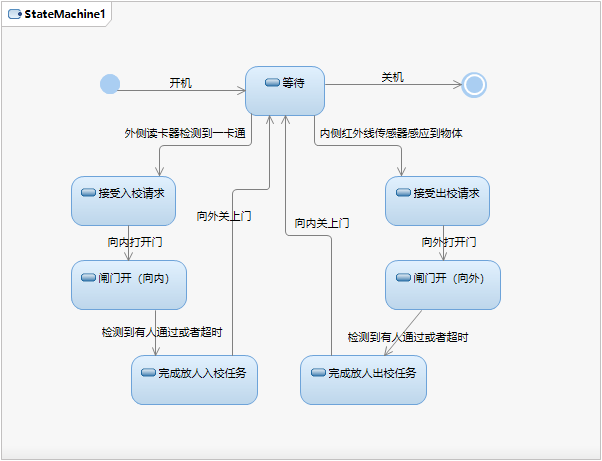

# 软件工程第二次作业

## 第一题 学校门禁系统

请仔细观察学校校门进出口闸机的工作方式，绘制单个闸机工作状态图。并结合状态图，说明学校门口闸机与其他闸机（例如高铁进站口闸机、图书馆进口闸机）在功能上的主要区别。

### 状态图

绘图如下

### 比较说明

最大的区别之一在于，高铁进站口闸机和图书馆进口闸机都是单向的，相比于校门口闸机的状态图可以去掉由内向外的那一部分。

此外就是一些细微的差别，比如验证身份的条件等。

## 第二题：请绘制安卓灰色应用检测系统的任务管理模块活动图。

安卓灰色应用检测系统中检测任务管理模块的主要功能是创建检测任务、查看检测任务、取消检测任务、删除检测记录、报告管理和通知管理。以上任务都是在用户成功登录系统后进行。

- 创建检测任务：用户要创建一个检测任务时，首先需要上传应用APK文件。用户成功登录系统后在系统首页点击应用检测按钮，Web客户端会出现一个弹窗提示用户上传安卓应用包文件。用户点击浏览按钮后可以在本地选择要上传的应用APK文件，点击确定后文件开始上传。检测平台会对上传的文件格式做一个初始校验。如果文件不以.apk 结尾，检测平台会提示用户文件格式错误并让用户重新上传。如果用户上传的文件格式正确，则任务创建成功。
- 查看检测任务：用户使用查看检测任务的功能时，服务端会在数据库查询相关信息，按照约定好的http报文格式将应用数据组装好传输给客户端。用户成功登录检测平台 后，检测平台的首页会展示任务列表，用户选择一个任务就可以进入任务详情页 面，任务详情页面可以获得应用的检测数据，如果还没有数据，那么详情页中对应的数据内容为空。
- 取消检测任务：对于一个正在进行中的任务，用户可以在任务列表中选中任务并点击取消按 钮，检测平台上提示确认信息，用户确认取消后，服务端会把该应用的相关信息 从数据库中删除并在服务器硬盘上删除和该应用相关的所有文件。
- 删除检测记录：删除检测记录的流程和取消检测任务的流程相似。用户选择一个已经结束的检测任务，并向检测平台提交删除检测记录的请求，服务端会删除和应用相关的所有文件和数据。
- 报告管理：动态检测引擎检测出灰色应用后，用户可以在相应任务列表中选中任务并点击浏览报告或下载报告按钮，服务端会在数据库查询相关信息返回客户端。
- 通知管理：当一个检测任务结束或者检测平台检测出灰色应用的时候，检测平台需要给用户及时发送通知。用户可在检测平台的首页点击并进入通知列表，进行阅读通知、删除通知的操作。

绘图如下：

