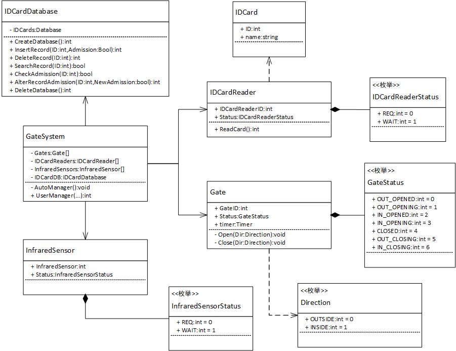

# 软件工程导论第三次作业

## 1. 请仔细观察学校校门进出口闸机的工作方式，设计相关的类，画出相应的类图。

### 类设计

```c++
enum IDCardReaderStatus{
	REQ, //读卡器读到了卡，正在请求回应
	WAIT //读卡器等待下一次读到卡
};
//红外线感应器状态
enum InfraredSensorStatus{
	REQ, //红外线感应器感应到有人通过，正在请求回应
	WAIT //红外线感应器等待下一个人通过
};
//闸门状态
enum GateStatus{
	OUT_OPENED,		//闸门向外打开
	OUT_OPENING,	//闸门正在向外打开
	IN_OPENED,		//闸门向内打开
	IN_OPENING,		//闸门正在向内打开
	CLOSED,			//闸门关闭
	OUT_CLOSING,	//闸门正在向外关闭
	IN_CLOSING,		//闸门正在向内关闭
};
//方向
enum Direction{
	OUTSIDE,		//向外
	INSIDE			//向内
};
//数据库，存储一卡通的准入信息
class IDCardDatabase{
    private:
		Database IDCards;//闸机系统所连接到的数据库，具体实现方式省略
    public:
		int CreateDatebase();//创建数据库并初始化一个空表格
		int InsertRecord(int ID,bool Admission);//增加一条新的记录
		int DeleteRecord(int ID);//以ID为索引，删除一条记录
		bool SearchRecord(int ID);//以ID为索引，搜索记录，返回其是否存在
		bool CheckAdmission(int ID);//以ID为索引，确认该ID是否有准入权限（包括不在数据库中的情况）
		int AlterRecordAdmission(int ID,bool NewAdmission);//以ID为索引，更新记录的准入权限情况
		int DeleteDatebase();//删除数据库
};
//一卡通本身
class IDCard{
    public:
		int ID;//一卡通的ID，作为唯一标识号
		string name;//一卡通的卡主名字
};
//读卡器
class IDCardReader{
    public:
		int IDCardReaderID;//读卡器的唯一标识ID
		IDCardReaderStatus Status;//标识读卡器的状态
		int ReadCard();//读卡，发起请求，如果有一卡通，返回读到的一卡通的ID，不然返回空
};
//红外线感应器
class InfraredSensor{
    public:
	int InfraredSensorID;//红外线感应器的唯一标识ID
	InfraredSensorStatus Status;//标识红外线传感器的状态，一次经过的操作是否正在激活中
};
//闸门本身,对于闸机系统来说可能有若干个
class Gate{
    public:
		int GateID;//闸门的唯一标识ID
		GateStatus Status;//闸门的状态
		Timer timer;//闸门内置的计时器，除非被归零，其始终保持自增，具体实现方式省略
		void Open(Direction Dir);//向着Dir指示的方向开门
		void Close(Direction Dir);//向着Dir指示的方向关门
};
//中控模块，采用时间触发
//轮询读卡器、红外线传感器读取信息、转换相应状态，
//如果考虑读卡器的请求，同时通过数据库进行验证
//再根据闸门的状态和Timer值，发起相应控制操作
//允许直接对闸门进行操作，比如某些时候校方会保持闸门始终开启或者关闭
class GateController{
    private:
		Gate Gates[];//中控模块管理所有闸门
		IDCardReader IDCardReaders[];//中控模块管理所有读卡器
		InfraredSensor InfraredSensors[];//中控模块管理所有红外线感应器
		IDCardDatabase IDCardDB;
		void AutoManager();//在没有用户介入的情况下，中控模块将自动轮询调度
	public:
		int UserManager(...);//在有特殊需要的时候，由用户手动设定，具体略，返回结果
};
```

具体信息已在代码中注明。本次设计考虑到如下情况

- 在特殊时期，闸机可以人为选择始终开启/关闭
- 一卡通的闸机准入权限可以在一定时间内开关
- 一卡通的闸机准入权限变动无需实体卡片验证，对实体卡片也无需录入

设计核心是中控模块。中控模块既做周期性的调度，但同时也可以直接接受用户的命令。

本次实际上使用了集合、定时器、数据库等对象，但相对于真正属于该系统的具体实现，这些对象略去。

### 类图



## 2.请绘制安卓灰色应用检测系统的任务管理模块类图。

安卓灰色应用检测系统中任务管理模块的主要功能是创建检测任务、查看检测任务、取消检测任务、删除检测记录、报告管理和通知管理。**将该模块分为三部分：**

- **第一部分：检测任务管理**

  - 1）创建检测任务

  用户要创建一个检测任务时，需要从本地上传应用APK文件，检测平台会对上传的文件格式做一个初始校验，如果文件格式错误，检测平台会进行提示并让用户重新上传，如果格式正确，则任务创建成功。

  - 2）查看检测任务

  用户可以查看检测任务，服务端会在数据库查询相关信息，按照约定好的http报文格式将应用数据组装好传输给客户端。

  - 3）取消检测任务

  对于一个正在进行中的任务，用户可以在任务列表中取消任务，服务端会把该应用的相关信息 从数据库中删除并在服务器硬盘上删除和该应用相关的所有文件。

  - 4）删除检测记录

  用户可以选择一个已经结束的检测任务，向检测平台提交删除检测记录的请求，服务端会删除和应用相关的所有文件和数据。

- **第二部分：报告管理**

动态检测引擎检测出灰色应用后，用户可以进行浏览报告或下载报告的操作，服务端会在数据库查询相关信息返回客户端。

- **第三部分：通知管理**

通知管理模块负责将检测任务结束通知和灰色应用检测通知推送给Web客户端。用户可进行阅读通知、删除通知的操作。

**请设计相关的类，完成该模块这三部分的类图。**

（附加：尝试画出检测平台的总体工作流程时序图，会有加分，但不作强制要求）

### 类设计

```c++

//任务状态
enum TaskStatus{
    SUBMIT,//已经提交任务，正在过初始检测
    PENDING,//任务已经在验证
    PASS,//任务验证完成，非灰色应用
    GREY//任务验证完成，是灰色应用
};
//应用
class Application{
    public:
        string Name;//应用名字
        string Path;//应用路径
        CreateApplication(string Name,string Path);//构造函数
        int DeleteApplication();//删应用对象
};
//通知
class Notice{
    public:
        int NoticeID;//通知ID
        int UserID;//用户ID
        string Information;//通知信息
        CreateNotice(int NoticeID,int UserID,string Information);//构造函数
        int DeleteNotice();//删通知对象
}
//报告
class Report{
    public:
        int TaskID;//任务ID
        string Information;//报告信息
        CreateReport(int TaskID,string Information);//构造函数
        int DeleteReport();//删报告对象
}
//任务
class Task{
    public:
        int TaskID;//任务ID
        int UserID;//用户ID
        TaskStatus Status;//任务状态
        Application APP;//任务检测的APP
        CreateTask(int ID,Application APP);//构造函数
        int DeleteTask();//删任务对象
};
//任务服务器
class TaskServer{
    private:
        HTTPPackets SendBack();//用于发回报文
    public:
        TaskDatabase Database;
        CheckEngine Engine;
        int SubmitTask(Task task);//提交任务，任务在客户端封装
        Task[] GetAllTasks(int UserID);//得到所有任务的信息
        int CancelTask(int TaskID);//取消任务
        int DeleteTask(int TaskID);//删除任务
        Report GetReport(int TaskID);//得到指定任务的报告
};
//通知中心
class NoticeModule{
    private:
        Notice Notices[];
    public:
        int AddNotice(Notice notice);//增加新的通知，通知由CheckEngine来封装
        Notice[] GetNotice(int UserID);//得到用户的通知
        int DeleteNotice(int NoticeID);//删除指定通知
}
//客户端
class Client{
    private:
        int NoticeFinished();//提示用户任务完成了
        int DisplayAllTask();//向用户显示所有任务
        int DisplayNotice();//向用户显示所有通知
        int DisplayReport();//向用户显示报告
    public:
        int UserID;//用户ID
        NoticeModule noticeModule;
        TaskServer taskServer;
        int CreateTask(APP:Application);//创建任务
        int ViewTasks();//查看任务
        int CancelTask(int ID);//取消任务
        int DeleteTask(int ID);//删除任务
        int ViewNotice();//查看通知
        int DeleteNotice(int ID);//删除通知
        int ViewReport(int ID);//查看报告
        int DownloadReport(int ID);//下载报告
};
//存放任务信息的数据库
class TaskDatabase{
    private:
        Task Tasks[];
        Report Reports[];
    public:
        int InsertRecord(Task task);//加入任务记录
        Task[] SelectAllRecords(int UserID);//返回指定用户的所有任务
        int DeleteRecord(int TaskID);//删除任务记录
        int FinishCheck(int TaskID,TaskStatus Status,Report report);//完成任务时更新数据库记录以及报告
        Report SelectReport(int TaskID);//返回指定任务的报告
};
//验证的机器
class CheckEngine{
    public:
        TaskDatabase Database;
        NoticeModule noticeModule;
        void run();//常驻线程，在完成任务的时候请求数据库更新并提交通知
        int InsertWork(Task task);//增加任务
        int CancelWork(int TaskID);//取消任务
};
```


### 类图


### 流程时序图

