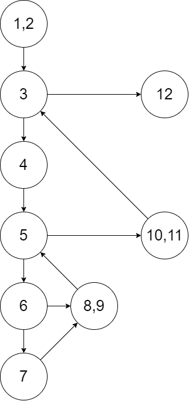

# 软件工程第四次作业

## 作业题1 ：

某计算机语言中规定，“标识符是由字母开头，后跟字母或数字的任意组合构成。有效字符数为8个，最大字符数为80个。不能是保留字”。请用等价类划分方法对标识符命名是否正确进行测试。要求给出等价类表，和具体的覆盖数据。

**解答：**

绘制等价类表如下

| 输入条件                   | 有效等价类                | 无效等价类                      |
| -------------------------- | ------------------------- | ------------------------------- |
| 标识符的开头               | （1）开头为字母；         | （2）开头为数字 ；              |
|                            |                           | （3）开头为非字母非数字的字符； |
| 标识符除了开头外的后续构成 | （4）空；                 | （8）存在非字母和数字的字符     |
|                            | （5）纯字母组合；         |                                 |
|                            | （6）纯数字组合；         |                                 |
|                            | （7）字母和数字组合；     |                                 |
| 字符数                     | （9）1~8个字符            | （10）空                        |
|                            |                           | （11）9~80个字符                |
|                            |                           | （12）>80个字符                 |
| 是否保留字                 | ·（13）不与任何保留字匹配 | （14）存在一个保留字与之匹配    |

覆盖数据如下

| 测试用例编号 | 输入                                    | 预期输出 | 覆盖等价类    |
| ------------ | --------------------------------------- | -------- | ------------- |
| 1            | K                                       | True     | (1)(4)(9)(13) |
| 2            | Satori                                  | True     | (1)(5)(9)(13) |
| 3            | F12                                     | True     | (1)(6)(9)(13) |
| 4            | USTC1958                                | True     | (1)(7)(9)(13) |
| 5            | 9isSmart                                | False    | (2)           |
| 6            | @12                                     | False    | (3)           |
| 7            | orz_                                    | False    | (8)           |
| 8            |                                         | False    | (10)          |
| 9            | Touhou12th                              | False    | (11)          |
| 10           | LagacyOfLunaticKingdom...(大于80个字符) | False    | (12)          |
| 11           | while(假定while是该编程语言的保留字)    | False    | (14)          |


## 作业题2：

给出以下两个代码的**环路复杂度**，并给出所有的**独立路径**，同时对于每条独立路径给出**完整测试用例以及对应输出**

### 代码一：

```c++
int i = 0;
int n = 4;
while (i < n-1) {
	j = i + 1;
	while(j < n) {
		if (A[i] < A[j]) {
			swap(A[i],A[j]);
		}
		j = j + 1
	}
	i = i + 1;
}
```

绘制流图（数字代表行号）



环路复杂度为 4 ，于是设计四个独立程序路径如下

- **测试路径a：**[1,2] -- [3] -- [12]
- **测试路径b：**[1,2] -- [3] -- [4] -- [5] -- [10,11] -- [3] -- [12]
- **测试路径c：**[1,2] -- [3] -- [4] -- [5] -- [6] -- [8,9] -- [5] --[10,11] -- [3] -- [12]
- **测试路径d：**[1,2] -- [3] -- [4] -- [5] -- [6] -- [7] -- [8,9] -- [5] --[10,11] -- [3] -- [12]

给出测试用例如下（[1,2]理解为输入），考虑测试路径 b ，如果其通过 [3] 到达 [4] ，那么 i 必定小于 n - 1，而同时在判定点 [5] 处，j = i + 1 < n，所以必然走到 [6] 而不可能跳转到 [10,11]，故这条路径实际上并不可能被执行到。而同时，它所包含的各个结点都可以在 c 、d 路径被执行到，故此处测试用例不考虑 b 路径。

| 测试路径 | 用例                              | 预期输出                |
| -------- | --------------------------------- | ----------------------- |
| a        | int i = 4; int n = 4; A为升序数组 | A未动，i、n等变量值不动 |
| c        | int i = 0; int n = 2; A = [2,1]   | A=[2,1]，i = 1，j=2     |
| d        | int i = 0; int n = 2; A = [1,2]   | A=[2,1]，i = 1，j=2     |


### 代码二：

```C++
public int sum(int n, int upperbound) {
	int result, i;
	result = 0;
	i = 0;
	if (n < 0) {
		n = -n;
	}
	while(i<n && result <= upperbound) {
		i = i + 1;
		result = result + i;
	}
	if(result <= upperbound) {
		System.out.printin("The sum is " + result);
	}
	else {
		System.out.printin("The sum is too large!");
	}
	return result;
}
```

绘制流图（各个基本块已在代码中注明）


环路复杂度为 5 ，于是设计五个独立程序路径如下

- **测试路径a：**[1] -- [2] -- [4] -- [7] -- [8] -- [10]
- **测试路径b：**[1] -- [2] -- [4] -- [7] -- [9] -- [10]
- **测试路径c：**[1] -- [2] -- [4] -- [5] -- [7] -- [9] -- [10]
- **测试路径d：**[1] -- [2] -- [3] -- [4] -- [5] -- [7] -- [9] -- [10]
- **测试路径e：**[1] -- [2] -- [4] -- [5] -- [6] -- [4] -- [7] -- [8] -- [10]

给出测试用例如下

| 测试路径 | 用例                    | 预期输出                              |
| -------- | ----------------------- | ------------------------------------- |
| a        | n = 0, upperbound = 0   | 程序结束，输出“The sum is 0”          |
| b        | n = 0, upperbound = -1  | 程序结束，输出“The sum is too large!” |
| c        | n = 1, upperbound = -1  | 程序结束，输出“The sum is too large!” |
| d        | n = -1, upperbound = -1 | 程序结束，输出“The sum is too large!” |
| e        | n = 1, upperbound = 5   | 程序结束，输出“The sum is 1”          |
